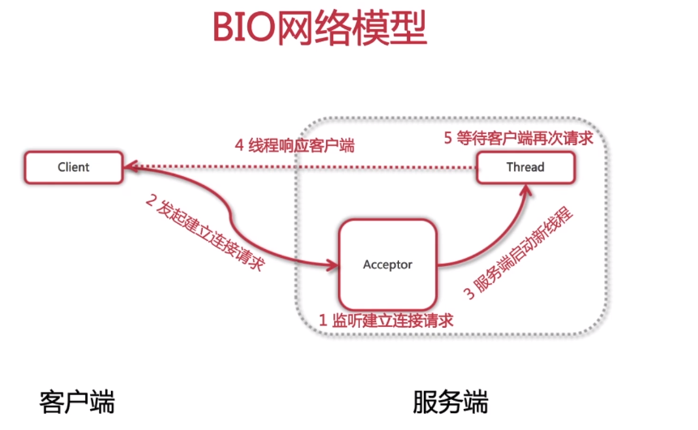

初识网络编程NIO实现多人聊天室

# New I/O

## 回顾BIO编程模型



服务端对于每个到达的客户端都重新开启一个线程专门处理它们之间的交互。
这种交互在逻辑上是客户端与服务端直接进行通信。
随着高并发的场景到来，服务器处理上下文切换，创建和销毁线程的代价，将会让服务器不堪重负。

## NIO编程模型构想


## NIO in JAVA


Channel　--> 区别于单向的InputStream/OutputStream，它是双向的。
Selector --> 主要的控制器
Buffer --> 读写两种模式可以通过flip切换。

# 多人聊天室实战

## Server 服务端

### 启动方法
ServerSocketChannel先创建，后绑定一个端口。
设置为非阻塞模式。
将channel注册到selector上，监听连接事件。
开始循环等待新接入的连接。


循环内：
每次调用selector.select()将会阻塞地等待至少一个channel准备就绪，返回准备就绪地channel数量。
如果数量为零，开始下一轮select();
数量不为零，则将这些准备就绪地channel取出来。
根据这些channel对应的当初向selector注册的类型(accept/read)，执行对应的业务逻辑。

```java
public void start() throws IOException {

    Selector selector = Selector.open();
    ServerSocketChannel serverSocketChannel = ServerSocketChannel.open();
    serverSocketChannel.bind(new InetSocketAddress(8000));
    serverSocketChannel.configureBlocking(false);
    serverSocketChannel.register(selector, SelectionKey.OP_ACCEPT);
    System.out.println("服务器启动成功！");

    for (;;) { 
        int readyChannels = selector.select();
        if (readyChannels == 0) continue;

        Set<SelectionKey> selectionKeys = selector.selectedKeys();
        Iterator iterator = selectionKeys.iterator();
        while (iterator.hasNext()) {

            SelectionKey selectionKey = (SelectionKey) iterator.next();

            if (selectionKey.isAcceptable()) {
                acceptHandler(serverSocketChannel, selector);
            }

            if (selectionKey.isReadable()) {
                readHandler(selectionKey, selector);
            }
        }
    }
}
```

### 连接建立处理
建立连接成功后，设置非阻塞模式，并且将这个刚刚建立的channel，注册到服务端的Selector。
```java
private void acceptHandler(ServerSocketChannel serverSocketChannel,
                           Selector selector)
        throws IOException {
    SocketChannel socketChannel = serverSocketChannel.accept();
    socketChannel.configureBlocking(false);
    socketChannel.register(selector, SelectionKey.OP_READ);
    socketChannel.write(Charset.forName("UTF-8")
            .encode("你与聊天室里其他人都不是朋友关系，请注意隐私安全"));
}
```

### 消息读取处理
```java
private void readHandler(SelectionKey selectionKey, Selector selector)
        throws IOException {
    SocketChannel socketChannel = (SocketChannel) selectionKey.channel();
    ByteBuffer byteBuffer = ByteBuffer.allocate(1024);

    String request = "";
    while (socketChannel.read(byteBuffer) > 0) {
        byteBuffer.flip();
        request += Charset.forName("UTF-8").decode(byteBuffer);
    }

	// 将channel再次注册到selector上，监听他的可读事件
    socketChannel.register(selector, SelectionKey.OP_READ);

    if (request.length() > 0) {
        broadCast(selector, socketChannel, request);
    }
}
```

### 消息广播
```java
private void broadCast(Selector selector,
	                   SocketChannel sourceChannel, String request) {
	
	// 获取到所有已经接入的客户端channel
	Set<SelectionKey> selectionKeySet = selector.keys();

	selectionKeySet.forEach(selectionKey -> {
	    Channel targetChannel = selectionKey.channel();

	    // 剔除发消息的客户端
	    if (targetChannel instanceof SocketChannel
	            && targetChannel != sourceChannel) {
	        try {
	            // 将信息发送到targetChannel客户端
	            ((SocketChannel) targetChannel).write(
	                    Charset.forName("UTF-8").encode(request));
	        } catch (IOException e) {
	            e.printStackTrace();
	        }
	    }
	});
}

```

## Client 客户端

### 启动方法

```java
public void start(String nickname) throws IOException {

    SocketChannel socketChannel = SocketChannel.open(
            new InetSocketAddress("127.0.0.1", 8000));

    Selector selector = Selector.open();
    socketChannel.configureBlocking(false);
    socketChannel.register(selector, SelectionKey.OP_READ);
    //开启一个线程专门处理服务端发来的消息
    new Thread(new NioClientHandler(selector)).start();

    //向服务端发送消息
    Scanner scanner = new Scanner(System.in);
    while (scanner.hasNextLine()) {
        String request = scanner.nextLine();
        if (request != null && request.length() > 0) {
            socketChannel.write(
                    Charset.forName("UTF-8")
                            .encode(nickname + " : " + request));
        }
    }
}
```

### 处理服务端消息
与服务端的start方法类似。
但客户端的Selector只注册了一个读事件的SocketChannel。
因此该Selector，实际上就只是不断地监听服务端有没有消息传过来。
如果有消息传来那么该Selector中绑定的这个唯一的channel就会编程已经就绪的状态，将会执行它的readHadler()。
所以客户端使用NIO和BIO的性能影响差别不大。
```java
@Override
public void run() {
    try {
        for (;;) {
            int readyChannels = selector.select();
            if (readyChannels == 0) continue;

            Set<SelectionKey> selectionKeys = selector.selectedKeys();
            Iterator iterator = selectionKeys.iterator();
            while (iterator.hasNext()) {
                SelectionKey selectionKey = (SelectionKey) iterator.next();

                if (selectionKey.isReadable()) {
                    readHandler(selectionKey, selector);
                }
            }
        }
    } catch (IOException e) {
        e.printStackTrace();
    }
}
```

**readHandler**

```java
private void readHandler(SelectionKey selectionKey, Selector selector)
        throws IOException {
    SocketChannel socketChannel = (SocketChannel) selectionKey.channel();
    ByteBuffer byteBuffer = ByteBuffer.allocate(1024);

    String response = "";
    while (socketChannel.read(byteBuffer) > 0) {
        byteBuffer.flip();
        response += Charset.forName("UTF-8").decode(byteBuffer);
    }

    socketChannel.register(selector, SelectionKey.OP_READ);

    if (response.length() > 0) {
        System.out.println(response);
    }
}
```